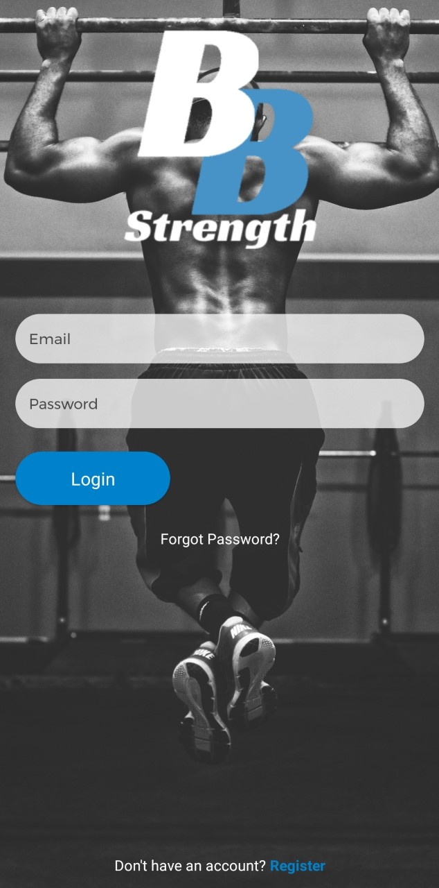
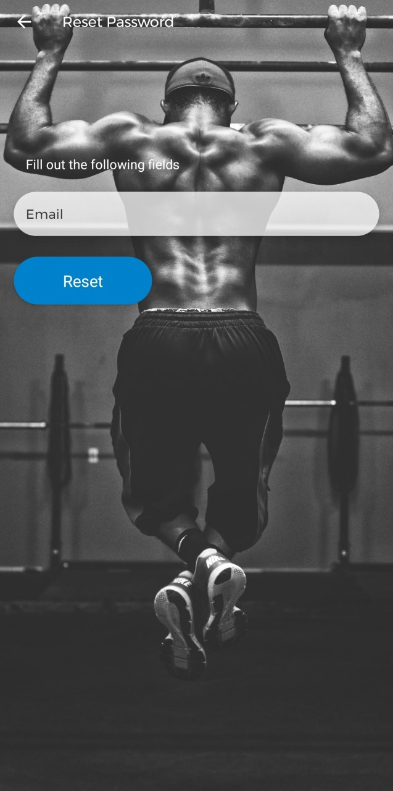
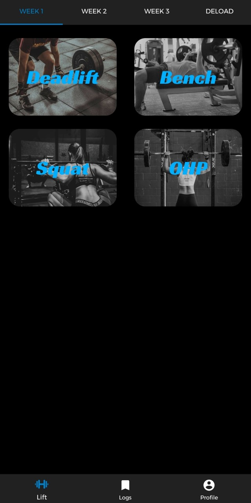
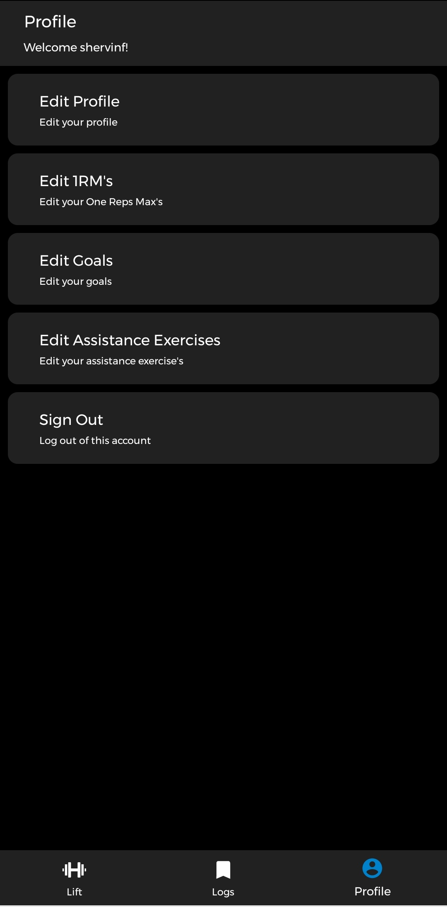

# BlackBookStrength

 BlackBook Strength is an android application designed mainly for people that train using the 5 3 1 
powerlifting philosophy that need a place to track there progress and calculate their next lifts. 
BlackBook Strength, among other features, also gives the user the ability to add assistance exercises, 
input their daily goal for calories and weightins but also track them. 

